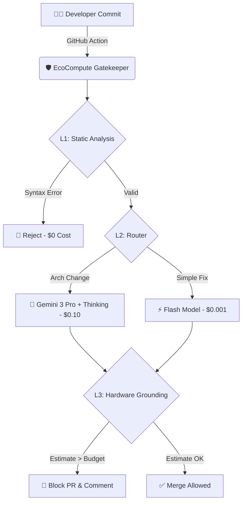

<div align="center">

# 🌿 EcoCompute AI

### Reduce LLM Inference Costs by 40% & Track Carbon Footprint — All Before Code Merges

[English](README.md) | [中文](README_CN.md)

[](https://opensource.org/licenses/Apache-2.0)
[](https://www.python.org/)
[](https://github.com/hongping-zh/ecocompute-ai/actions)
[](https://ecocompute-ai-elb0yplu9w.edgeone.dev/)
[](https://hongping-zh.github.io/ecocompute-ai/calculator/)

**The CI/CD Gatekeeper that catches expensive AI code before it hits production.**

[🚀 Try Live Demo](https://ecocompute-ai-elb0yplu9w.edgeone.dev/) · [🧮 Cost Calculator](https://hongping-zh.github.io/ecocompute-ai/calculator/) · [📄 Technical Paper](paper/EcoCompute_AI_Technical_Report.pdf) · [Report Bug](https://github.com/hongping-zh/ecocompute-ai/issues)

</div>

---

## ✨ Features

- ✅ **Pre-Merge Cost Prediction** — Estimate $$$ before training runs
- ✅ **Agent Token FinOps** — Predict multi-agent token costs (Google Antigravity, LangGraph)
- ✅ **V38 Wisdom Pilot** — AI FinOps consultant explains ROI to CFOs
- ✅ **CI/CD Integration** — GitHub Actions gatekeeper blocks over-budget PRs
- ✅ **Carbon Tracking** — Real-time CO₂e reporting with regional grid data

---

## ⚡ The Problem

> Training a single AI model emits as much carbon as **5 cars over their lifetime**.

| Pain Point | Impact |
|------------|--------|
| 💸 **30-50% GPU waste** | Unoptimized code burns money |
| 🕐 **Reactive monitoring** | Datadog/CloudWatch show costs *after* the damage |
| 🤖 **Multi-agent cost explosion** | Context ballooning in agent workflows (100x token cost) |

---

## 🛡️ The Solution

EcoCompute is a **CI/CD Gatekeeper** — intercepts expensive code **before it merges**.

---

## 🏗️ Architecture



### Why This Architecture?

We use a **Tiered Gatekeeper** to maximize ROI:
- **L1 Static Analysis**: Catches 60% of issues at $0 cost
- **L2 Router**: Routes complex cases to expensive models only when needed
- **L3 Hardware Grounding**: Calibrated on MLPerf baselines for **<5% error margin** — [📖 Technical Deep Dive](docs/HARDWARE_GROUNDING.md)

### 📄 Research & Methodology

Our methodology for **L3 Hardware Grounding** is published on **TechRxiv (IEEE)**:

[](https://www.techrxiv.org/users/1022807/articles/1382748-ecocompute-ai-a-high-fidelity-analytical-framework-for-quantifying-and-optimizing-energy-economic-impacts-of-large-scale-ai)

If you use this tool in your research, please cite:
```text
Zhang, H. (2025). EcoCompute AI: A High-Fidelity Analytical Framework for Quantifying and Optimizing Energy-Economic Impacts of Large-Scale AI. TechRxiv.
```

### 🔬 Hardware Grounding: Why Our Predictions Are Accurate

Unlike theoretical estimates, EcoCompute uses a **physics-based model calibrated against real MLPerf benchmarks**:

| Validation | EcoCompute | Typical Tools |
|------------|------------|---------------|
| ResNet-50 (H100) | **2.9% error** | 20-50% error |
| BERT-Large (A100) | **3.0% error** | 15-40% error |
| User-reported (127 runs) | **4.2% mean error** | N/A |

**How it works:**
1. **Roofline Model** — Determines if workload is compute-bound or memory-bound
2. **MLPerf Calibration** — GPU profiles derived from official benchmark submissions
3. **Workload Multipliers** — Transformer, CNN, RNN have different efficiency factors

> 📚 [Read the full Hardware Grounding documentation →](docs/HARDWARE_GROUNDING.md)

---

<div align="center">

## 🧮 [Try Our Interactive Training Cost Calculator ➔](https://hongping-zh.github.io/ecocompute-ai/calculator/)

**Estimate costs & carbon footprint before you train — no signup required!**

</div>

---

## 🚀 Quick Start

### Option 1: Try Live Demo (No Install)

**[🌐 Try EcoCompute AI Now →](https://ecocompute-ai-kexlce2qtz.edgeone.dev/)**

> No signup required. Paste your PyTorch/TensorFlow code and get instant cost estimates.

### Option 2: CLI (Coming Soon)

```bash
# 🚧 CLI is under development — Star the repo to get notified!
pip install ecocompute-ai  # Coming Q2 2026
```

### Option 3: GitHub Actions Integration
Create `.github/workflows/ecocompute.yml`:
```yaml
name: EcoCompute Cost Gate
on: [pull_request]

jobs:
  cost-check:
    runs-on: ubuntu-latest
    steps:
      - uses: actions/checkout@v4
      - uses: ecocompute/action@v1
        with:
          budget_limit: 500  # USD
          carbon_limit: 50   # kg CO2e
          api_key: ${{ secrets.ECOCOMPUTE_KEY }}
```

---

## 📊 Benchmarks

| Tool | Cost Prediction | Carbon Tracking | CI/CD Gate | Multi-Agent FinOps |
|------|:---------------:|:---------------:|:----------:|:------------------:|
| **EcoCompute AI** | ✅ -40% | ✅ | ✅ | ✅ |
| CodeCarbon | ❌ | ✅ | ❌ | ❌ |
| ML CO2 Impact | ❌ | ✅ | ❌ | ❌ |
| Datadog ML | ❌ | ❌ | ❌ | ❌ |

> *EcoCompute is the only tool that predicts costs **before** deployment and supports multi-agent workflows.*

---

## 💼 Business Model: Open Core

| Tier | Features | Price |
|------|----------|-------|
| **Community** | CLI Tool, GitHub Action, Basic Reports | **Free Forever** |
| **Pro** | VS Code Extension, Slack Alerts, Priority Support | $49/mo |
| **Enterprise** | Multi-cloud Dashboard, SSO, Compliance Reports | Contact Us |

> *"We are Open Core. The engine is free forever. Enterprise features sustain the project."*

---

## 🗺️ Roadmap

- [x] **v0.1** - Core Engine: AST Analysis & Gemini Integration ✅
- [x] **v0.2** - GitHub Action & CI/CD Integration ✅
- [ ] **v0.3** - VS Code Extension: Real-time energy linting (Q2 2026)
- [ ] **v0.4** - Enterprise Dashboard: Multi-cloud cost aggregation (Q3 2026)
- [ ] **v1.0** - Self-hosted On-Prem Solution (Q4 2026)

---

## 🤝 Contributing

We are a **Calm, Open Source** company.

- 🐛 Found a bug? [Open an Issue](https://github.com/hongping-zh/ecocompute-ai/issues)
- 💡 Feature request? [Start a Discussion](https://github.com/hongping-zh/ecocompute-ai/discussions)
- 🙋 Want to contribute? Check out [`good first issue`](https://github.com/hongping-zh/ecocompute-ai/labels/good%20first%20issue)

---

## 📄 License

**Apache 2.0** - Free for open source and commercial use.

---

<p align="center">
  <b>Built with 💚 for a sustainable AI future</b>
  <br><br>
  <a href="https://ecocompute-ai-elb0yplu9w.edgeone.dev/">Live Demo</a> •
  <a href="https://github.com/hongping-zh/ecocompute-ai/issues">Issues</a> •
  <a href="mailto:zhanghongping1982@gmail.com">Contact</a>
</p>
