# 🌿 EcoCompute AI

**The Green FinOps Gatekeeper for PyTorch & TensorFlow**

[](https://opensource.org/licenses/Apache-2.0)
[]()
[]()
[]()
[](https://ecocompute-ai-d8zeusq2ti.edgeone.dev/)

> "We don't just monitor cloud costs. We **prevent** them."

---

## ⚡ The Problem

Training a single AI model can cost as much as a house.

- **30-50%** of GPU spend is wasted on unoptimized code
- Engineers don't see the bill until the end of the month
- Existing tools (Datadog/CloudWatch) are **reactive** — by then, it's too late

---

## 🛡️ The Solution

EcoCompute is a **CI/CD Gatekeeper**. It intercepts expensive code **before it merges**.

### Core Features

| Feature | Description |
|---------|-------------|
| 🔮 **Pre-Merge Cost Prediction** | Estimates $$$ of a training run by analyzing AST + Arithmetic Intensity |
| 🧠 **Hybrid Reasoning Engine** | Uses **Gemini 3 Pro** to understand complex model architectures (Transformers, CNNs) |
| 🛑 **Budget Enforcement** | Automatically blocks Pull Requests that violate team budget policies |
| 🔋 **Carbon Impact Report** | Translates FLOPs into CO₂e/kWh with regional grid data |
| ⚡ **Auto-Optimization** | Suggests refactors (Quantization, Fusion) to cut costs by 30-50% |

---

## 🏗️ Architecture

```mermaid
graph TD
    A[👨‍💻 Developer Commit] -->|GitHub Action| B(🛡️ EcoCompute Gatekeeper)
    B --> C{L1: Static Analysis}
    C -->|Syntax Error| X[🚫 Reject - $0 Cost]
    C -->|Valid| D{L2: Router}
    D -->|Simple Fix| E[⚡ Flash Model - $0.001]
    D -->|Arch Change| F[🧠 Gemini 3 Pro + Thinking - $0.10]
    F --> G{L3: Hardware Grounding}
    G -->|Estimate > Budget| H[🚫 Block PR & Comment]
    G -->|Estimate OK| I[✅ Merge Allowed]
    E --> G
```



### Why This Architecture?

We use a **Tiered Gatekeeper** to maximize ROI:
- **L1 Static Analysis**: Catches 60% of issues at $0 cost
- **L2 Router**: Routes complex cases to expensive models only when needed
- **L3 Hardware Grounding**: Calibrated on MLPerf baselines for <1% error margin

---

## 🚀 Quick Start

### Option 1: Try Live Demo
**[🌐 Experience EcoCompute AI Now](https://ecocompute-ai-d8zeusq2ti.edgeone.dev/)**

### Option 2: Install via Pip
```bash
pip install ecocompute
```

### Option 3: Docker (Recommended)
```bash
docker run -it ecocompute/audit --dry-run
```

### Run Your First Audit
```bash
# Scan your model file for expensive operations
ecocompute audit --path ./src/model.py --gpu "nvidia-h100"

# Output:
# ┌─────────────────────────────────────────────────┐
# │ 🔍 EcoCompute Analysis Report                   │
# ├─────────────────────────────────────────────────┤
# │ Estimated Cost:     $487.50                     │
# │ Estimated Carbon:   12.3 kg CO₂e                │
# │ Optimization Found: Matrix multiplication L45   │
# │ Potential Savings:  $150 (31%)                  │
# └─────────────────────────────────────────────────┘
```

### Add to GitHub Actions
Create `.github/workflows/ecocompute.yml`:
```yaml
name: EcoCompute Cost Gate
on: [pull_request]

jobs:
  cost-check:
    runs-on: ubuntu-latest
    steps:
      - uses: actions/checkout@v4
      - uses: ecocompute/action@v1
        with:
          budget_limit: 500  # USD
          carbon_limit: 50   # kg CO2e
          api_key: ${{ secrets.ECOCOMPUTE_KEY }}
```

---

## 💼 Business Model: Open Core

| Tier | Features | Price |
|------|----------|-------|
| **Community** | CLI Tool, GitHub Action, Basic Reports | **Free Forever** |
| **Pro** | VS Code Extension, Slack Alerts, Priority Support | $49/mo |
| **Enterprise** | Multi-cloud Dashboard, SSO, Compliance Reports | Contact Us |

> *"We are Open Core. The engine is free forever. Enterprise features sustain the project."*

---

## 🗺️ Roadmap

- [x] **v0.1** - Core Engine: AST Analysis & Gemini Integration ✅
- [x] **v0.2** - GitHub Action & CI/CD Integration ✅
- [ ] **v0.3** - VS Code Extension: Real-time energy linting (Q2 2026)
- [ ] **v0.4** - Enterprise Dashboard: Multi-cloud cost aggregation (Q3 2026)
- [ ] **v1.0** - Self-hosted On-Prem Solution (Q4 2026)

---

## 🤝 Contributing

We are a **Calm, Open Source** company.

- 🐛 Found a bug? [Open an Issue](https://github.com/hongping-zh/https-github.com-hongping-zh/issues)
- 💡 Feature request? [Start a Discussion](https://github.com/hongping-zh/https-github.com-hongping-zh/discussions)
- 🙋 Want to contribute? Check out [`good first issue`](https://github.com/hongping-zh/https-github.com-hongping-zh/labels/good%20first%20issue)

---

## 📄 License

**Apache 2.0** - Free for open source and commercial use.

---

<p align="center">
  <b>Built with 💚 for a sustainable AI future</b>
  <br><br>
  <a href="https://ecocompute-ai-d8zeusq2ti.edgeone.dev/">Live Demo</a> •
  <a href="https://github.com/hongping-zh/https-github.com-hongping-zh/issues">Issues</a> •
  <a href="mailto:zhanghongping1982@gmail.com">Contact</a>
</p>
