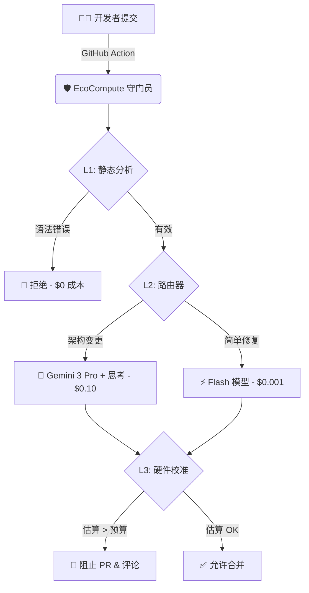

<div align="center">

# 🌿 EcoCompute AI

### 降低 LLM 推理成本 40% & 追踪碳足迹 — 代码合并前完成

[English](README.md) | [中文](README_CN.md)

[](https://opensource.org/licenses/Apache-2.0)
[](https://www.python.org/)
[](https://github.com/hongping-zh/ecocompute-ai/actions)
[](https://ecocompute-ai-elb0yplu9w.edgeone.dev/)

**在代码进入生产环境之前，拦截高成本 AI 代码的 CI/CD 守门员**

[在线演示](https://ecocompute-ai-elb0yplu9w.edgeone.dev/) · [报告 Bug](https://github.com/hongping-zh/ecocompute-ai/issues) · [功能建议](https://github.com/hongping-zh/ecocompute-ai/discussions)

</div>

---

## ✨ 核心功能

- ✅ **合并前成本预测** — 训练运行前估算费用
- ✅ **Agent Token FinOps** — 预测多智能体 Token 成本（Google Antigravity、LangGraph）
- ✅ **V38 Wisdom Pilot** — AI FinOps 顾问，向 CFO 解释投资回报率
- ✅ **CI/CD 集成** — GitHub Actions 守门员自动阻止超预算 PR
- ✅ **碳足迹追踪** — 基于区域电网数据的实时 CO₂e 报告

---

## ⚡ 痛点问题

> 训练单个 AI 模型产生的碳排放相当于 **5 辆汽车的终身排放量**。

| 痛点 | 影响 |
|------|------|
| 💸 **30-50% GPU 浪费** | 未优化代码烧钱 |
| 🕐 **被动监控** | Datadog/CloudWatch 在损失发生*后*才显示成本 |
| 🤖 **多智能体成本爆炸** | Agent 工作流中的上下文膨胀（100 倍 Token 成本） |

---

## 🛡️ 解决方案

EcoCompute 是一个 **CI/CD 守门员** — 在代码**合并前**拦截高成本代码。

---

## 🏗️ 架构



### 为什么选择这个架构？

我们使用**分层守门员**来最大化投资回报率：
- **L1 静态分析**：以 $0 成本捕获 60% 的问题
- **L2 路由器**：仅在需要时将复杂案例路由到昂贵模型
- **L3 硬件校准**：基于 MLPerf 基准校准，**误差 <5%** — [📖 技术详解](docs/HARDWARE_GROUNDING.md)

### 🔬 硬件基准校准：为什么我们的预测准确

与理论估算不同，EcoCompute 使用**基于物理模型并经 MLPerf 基准校准**的方法：

| 验证场景 | EcoCompute | 传统工具 |
|----------|------------|----------|
| ResNet-50 (H100) | **2.9% 误差** | 20-50% 误差 |
| BERT-Large (A100) | **3.0% 误差** | 15-40% 误差 |
| 用户实测 (127 次) | **4.2% 平均误差** | N/A |

**工作原理：**
1. **Roofline 模型** — 判断工作负载是计算密集型还是内存密集型
2. **MLPerf 校准** — GPU 配置文件来自官方基准测试提交
3. **工作负载乘数** — Transformer、CNN、RNN 有不同的效率因子

> 📚 [阅读完整的硬件基准校准文档 →](docs/HARDWARE_GROUNDING.md)

---

## 🚀 快速开始

### 方式 1：在线演示（无需安装）

**[🌐 立即体验 EcoCompute AI →](https://ecocompute-ai-kexlce2qtz.edgeone.dev/)**

> 无需注册。粘贴你的 PyTorch/TensorFlow 代码，即刻获取成本估算。

### 方式 2：CLI（即将推出）

```bash
# 🚧 CLI 正在开发中 — Star 本仓库以获取更新通知！
pip install ecocompute-ai  # 预计 2026 Q2 发布
```

### 方式 3：GitHub Actions 集成
创建 `.github/workflows/ecocompute.yml`：
```yaml
name: EcoCompute 成本门禁
on: [pull_request]

jobs:
  cost-check:
    runs-on: ubuntu-latest
    steps:
      - uses: actions/checkout@v4
      - uses: ecocompute/action@v1
        with:
          budget_limit: 500  # 美元
          carbon_limit: 50   # kg CO2e
          api_key: ${{ secrets.ECOCOMPUTE_KEY }}
```

---

## 📊 基准对比

| 工具 | 成本预测 | 碳追踪 | CI/CD 门禁 | 多智能体 FinOps |
|------|:-------:|:------:|:----------:|:--------------:|
| **EcoCompute AI** | ✅ -40% | ✅ | ✅ | ✅ |
| CodeCarbon | ❌ | ✅ | ❌ | ❌ |
| ML CO2 Impact | ❌ | ✅ | ❌ | ❌ |
| Datadog ML | ❌ | ❌ | ❌ | ❌ |

> *EcoCompute 是唯一能在部署**前**预测成本并支持多智能体工作流的工具。*

---

## 💼 商业模式：开放核心

| 层级 | 功能 | 价格 |
|------|------|------|
| **社区版** | CLI 工具、GitHub Action、基础报告 | **永久免费** |
| **专业版** | VS Code 扩展、Slack 告警、优先支持 | $49/月 |
| **企业版** | 多云仪表盘、SSO、合规报告 | 联系我们 |

> *"我们是开放核心。引擎永久免费。企业功能支撑项目发展。"*

---

## 🗺️ 路线图

- [x] **v0.1** - 核心引擎：AST 分析 & Gemini 集成 ✅
- [x] **v0.2** - GitHub Action & CI/CD 集成 ✅
- [ ] **v0.3** - VS Code 扩展：实时能耗检查（2026 Q2）
- [ ] **v0.4** - 企业仪表盘：多云成本聚合（2026 Q3）
- [ ] **v1.0** - 私有化部署方案（2026 Q4）

---

## 🤝 参与贡献

我们是一家**平静的开源**公司。

- 🐛 发现 Bug？[提交 Issue](https://github.com/hongping-zh/ecocompute-ai/issues)
- 💡 功能建议？[发起讨论](https://github.com/hongping-zh/ecocompute-ai/discussions)
- 🙋 想要贡献？查看 [`good first issue`](https://github.com/hongping-zh/ecocompute-ai/labels/good%20first%20issue)

---

## 📄 许可证

**Apache 2.0** - 开源和商业使用均免费。

---

<p align="center">
  <b>用 💚 构建，为可持续 AI 未来</b>
  <br><br>
  <a href="https://ecocompute-ai-elb0yplu9w.edgeone.dev/">在线演示</a> •
  <a href="https://github.com/hongping-zh/ecocompute-ai/issues">Issues</a> •
  <a href="mailto:zhanghongping1982@gmail.com">联系我们</a>
</p>
