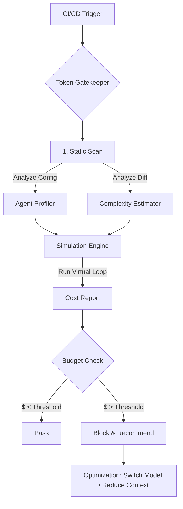

# Token FinOps: Multi-Agent Cost Prediction Model

## 1. Core Concept

In a multi-agent environment (e.g., Google Antigravity), costs are driven not just by model choice, but by **Context Velocity**—how fast the context window fills up as agents exchange messages.

EcoCompute AI introduces a **Token FinOps Engine** to simulate these interactions before they happen.

## 2. Mathematical Model

The total cost ($C_{Total}$) is the sum of costs for all agents over all turns.

$$ C_{Total} = \sum_{t=1}^{T} \sum_{a=1}^{N} ( I_{a,t} \times P_{In, a} + O_{a,t} \times P_{Out, a} ) $$

Where:
- $T$: Number of turns (iterations).
- $N$: Number of active agents.
- $I_{a,t}$: Input tokens for Agent $a$ at turn $t$.
- $O_{a,t}$: Output tokens for Agent $a$ at turn $t$.
- $P_{In, a}, P_{Out, a}$: Pricing for the specific model used by Agent $a$ (e.g., Gemini 1.5 Pro).

### The "Context Ballooning" Effect

Input tokens ($I_{a,t}$) are not constant. They grow with conversation history:

$$ I_{a,t} = S_{System} + S_{Repo} + \sum_{k=1}^{t-1} (O_{All, k}) $$

- $S_{System}$: System prompt tokens (fixed).
- $S_{Repo}$: Retrieved repository context (files read).
- $\sum O_{All, k}$: Cumulative history of all previous agent outputs (conversation history).

## 3. Heuristics for Prediction

To predict costs *without* running the agents, we use **Task Complexity Heuristics**:

| Task Type | Context Strategy ($S_{Repo}$) | Est. Turns ($T$) | Est. Output ($O$) |
|-----------|-------------------------------|------------------|-------------------|
| **Fix Typo** | Single File (Low) | 1-2 | Low (Diff only) |
| **Refactor** | Module/Folder (High) | 5-10 | High (Full code) |
| **Unit Tests** | Class + Test File (Med) | 3-5 | Med (Test cases) |
| **Review** | Git Diff (Low-Med) | 1 | Med (Comments) |

## 4. Architecture: The Token Gatekeeper

## 5. Pricing Data (Example - Gemini 1.5 Pro)

- **Input**: $3.50 / 1M tokens
- **Output**: $10.50 / 1M tokens
- **Context Window**: up to 2M tokens

*Note: Prices subject to change, pulled dynamically in production.*
